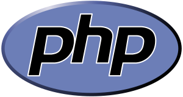

PHP as it's known today is actually the successor to a product named PHP/FI. Created in 1994 by Rasmus Lerdorf, the very first incarnation of PHP was a simple set of Common Gateway Interface (CGI) binaries written in the C programming language. Originally used for tracking visits to his online resume, he named the suite of scripts "Personal Home Page Tools," more frequently referenced as "PHP Tools." Over time, more functionality was desired, and Rasmus rewrote PHP Tools, producing a much larger and richer implementation. This new model was capable of database interaction and more, providing a framework upon which users could develop simple dynamic web applications such as guestbooks. In June of 1995, Rasmus » released the source code for PHP Tools to the public, which allowed developers to use it as they saw fit. This also permitted - and encouraged - users to provide fixes for bugs in the code, and to generally improve upon it.

- Install PHP [en](contents/en/install.md) | [pt-br](contents/pt_br/install.md)
