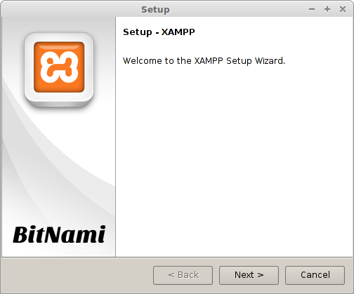
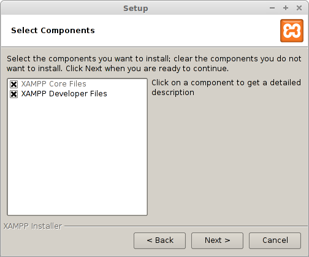
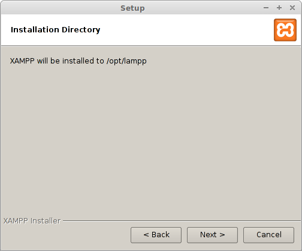
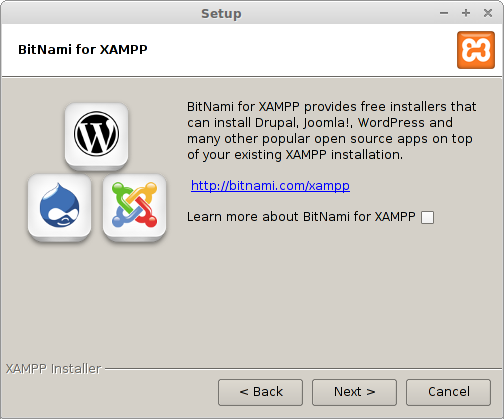
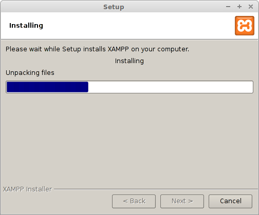
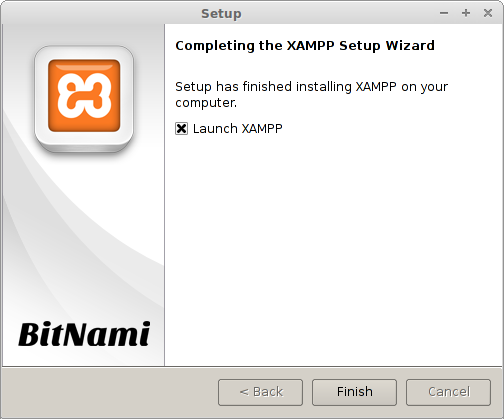
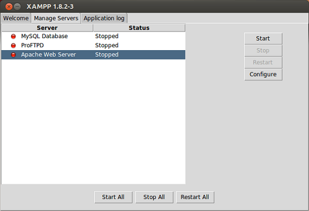

# How to install PHP

- [Ubuntu](#ubuntu)
- [Windows](#windows)

O processo de instalação do xampp é bem parecido nos principais sistemas operacionais

## How to install PHP on Ubuntu <a name="ubuntu"></a>

1. Go to [XamppInstaller](https://www.apachefriends.org/pt_br/download.html)
2. Click on Download in version 7.x
3. Open your terminal ctrl + alt + t.
4. Type the command ```cd Downloads.```
5. Change permission of xampp```chmod 755 xampp-linux-xxx-installer.run```
6. Then run this command ```./xampp-linux-xxx-installer.run``` Where xxx is the version that you choose
7. [Installing the Xampp](#instalando_xampp)

### How to open the xampp's panel
1. Open your terminal ctrl + alt + t  Type it: ```cd /opt/lampp```
2. Then ```sudo chmod 777 manager-linux-xxx.run ```
3. and ```sudo ./manager-linux-x64.run```
4. Congratulation your xampp is running.

## How to install PHP on Windows<a name="windows"></a>

1. Go to [XamppInstaller](https://www.apachefriends.org/pt_br/download.html)
2. Click on Download in version 7.x
3. When asked, click in "Save" and wait the download complete.
4. When finished downloading, open the installer.
5. [Installing the Xampp](#instalando_xampp)
6. On desktop click in xampp's icon.
8. You can start others components, if you intend use it.

Congrats your xampp already is installed.

## How to install xampp<a name="instalando_xampp">

- [What is Xampp?](#xampp)

1 . When running the installer appears the xampp's installation window:



2 . Click on "Next" will be shown following window:



3 . Click on "Next"



4 . Click once more on "Next"



5 . "Next", once more. Wait for the installation:



6 . When finished, this is the last window:



7 . Click on "Finish" and will open the following window:



8 . Select your Apache Web Server and click on "Start"

9 . Open your browser then type ```http://localhost``` and your apache server is ready.


## What is Xampp<a name="xampp">
XAMPP is an independent server platform, free software, which consists mainly of the MySQL database, which was replaced by MariaDB, the Apache web server and interpreters for scripting languages: PHP and Perl. The name comes from the abbreviation X (for any of the different operating systems), Apache, MariaDB, PHP, Perl. It is a method that makes it extremely easy for developers to create a local web server for testing purposes.
