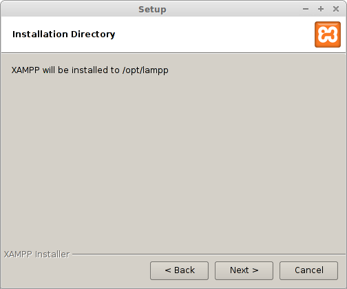
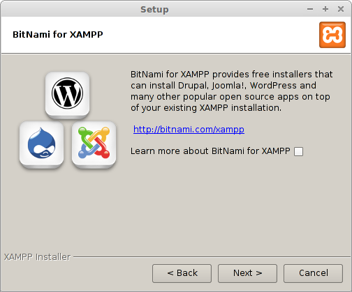
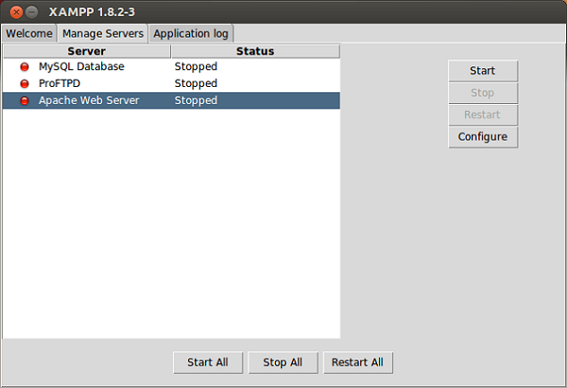

# Como instalar o PHP

- [Ubuntu](#ubuntu)
- [Windows](#windows)

O processo de instalação do xampp é bem parecido nos principais sistemas operacionais

## Como Instalar o PHP no Ubuntu <a name="ubuntu"></a>

1. Passo vá para [XamppInstaller](https://www.apachefriends.org/pt_br/download.html)
2. Passo Clique em download na versão 7.x
3. Abra o seu terminal ctrl + alt + t.
4. Digite o seguinte comando ```cd Downloads.```
5. Altere a permissão de seu instalador ```chmod 755 xampp-linux-xxx-installer.run```
6. Em seguida digite ```./xampp-linux-xxx-installer.run``` Onde xxx é a versão que você escolheu
7. [Instalando o Xampp](#instalando_xampp)

### Abrindo o xampp panel
15. Para abrir o xampp panel abra o terminal ctrl + alt + t  Digite: ```cd /opt/lampp```
16. Em Seguida ```sudo chmod 777 manager-linux-xxx.run ```
17. e ```sudo ./manager-linux-x64.run```pronto o seu xampp panel está sendo executado.

## Como Instalar o PHP no Ubuntu<a name="windows"></a>

1. Passo vá para https://www.apachefriends.org/pt_br/download.html.
2. Passo Clique em download na versão 7.x
3. Quando for solicitado o download, clique em "Salvar" e aguarde o download terminar.
4. Assim que terminar o download, Abra o instalador
5. [Instalando o Xampp](#instalando_xampp)
6. Na área de trabalho clique no ícone do xampp.
8. Inicie os componentes Apache e MySQL. Você também poderá iniciar os outros componentes, caso pretenda usá-los.

Pronto seu xampp já está instalado!

## Instalando o Xampp<a name="instalando_xampp">

- [O que é Xampp?](#xampp)

1. Ao executar o instalador aparecerá a janela de instalação do xampp


2. Clique em "Next" irá aparecer a seguinte janela


3. Clique em "Next"


4. Clique mais uma vez em "Next"


5. "Next", mais uma vez. Aguarde a instalação:


6. Quando terminar, esta será a última janela:


7. Clique em "Finish" e abrirá a seguinte janela:


8. Selecione o seu Apache Web Server e clique em "Start"
9. Abra seu navegador e digite localhost e pronto o seu apache server já está pronto.


## O que é Xampp<a name="xampp">
XAMPP é um servidor independente de plataforma, software livre, que consiste principalmente na base de dados MySQL, o qual foi substituído pelo MariaDB, o servidor web Apache e os interpretadores para linguagens de script: PHP e Perl. O nome provem da abreviação de X (para qualquer dos diferentes sistemas operativos), Apache, MariaDB, PHP, Perl. É um método que torna extremamente fácil para os desenvolvedores a criar um servidor web local para fins de teste.
